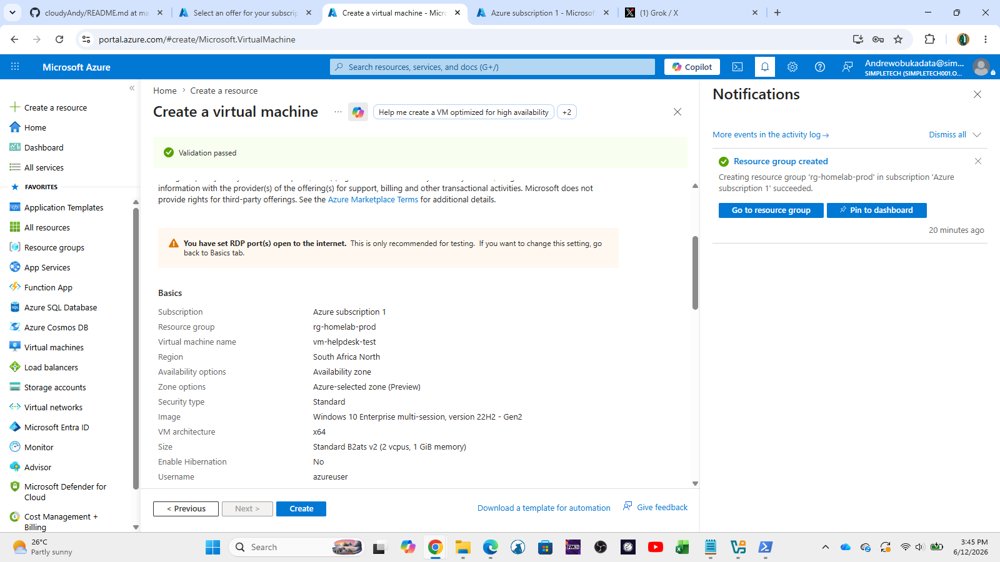
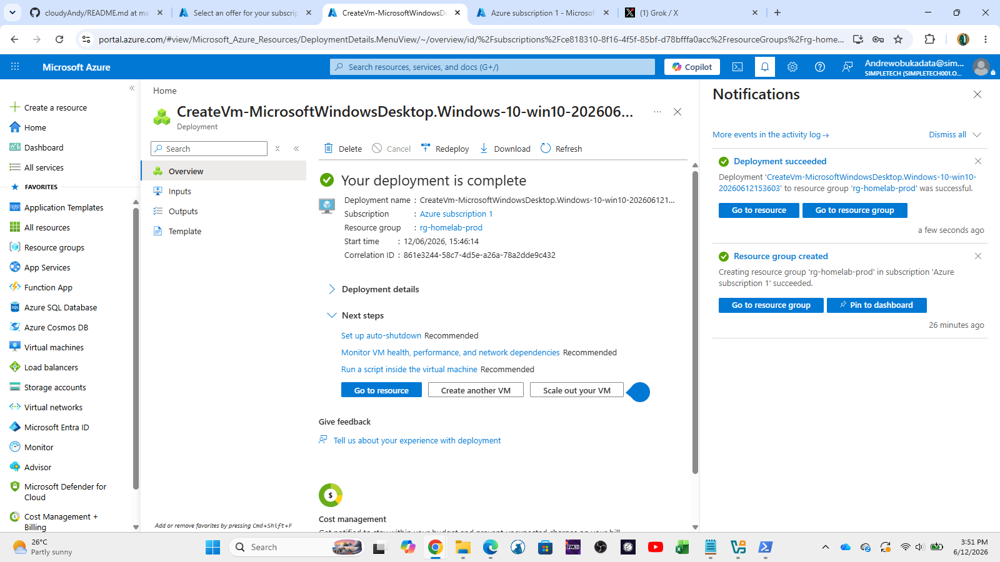
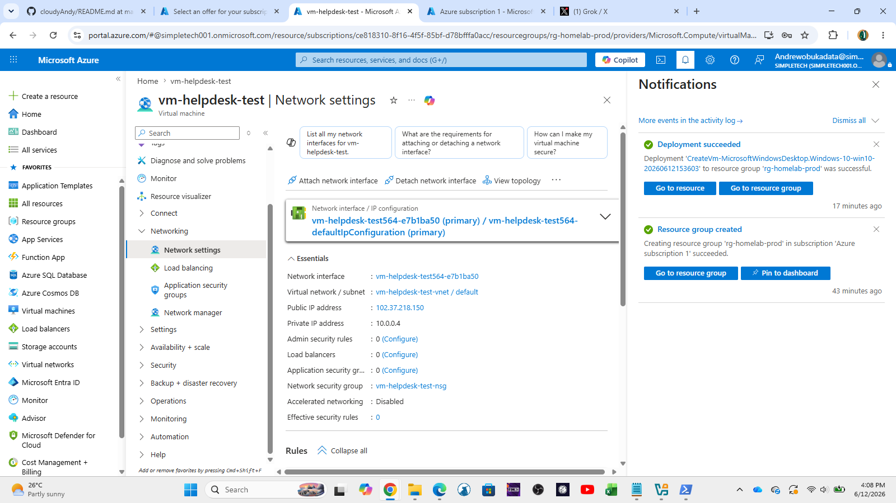
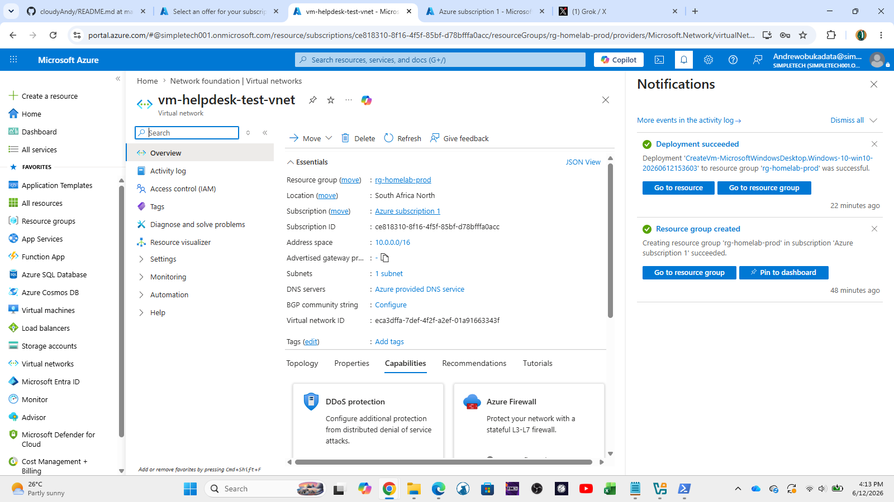
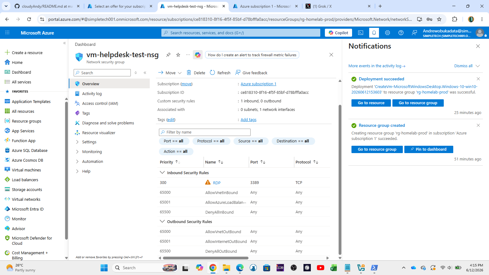
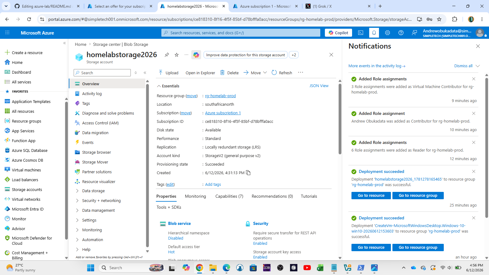
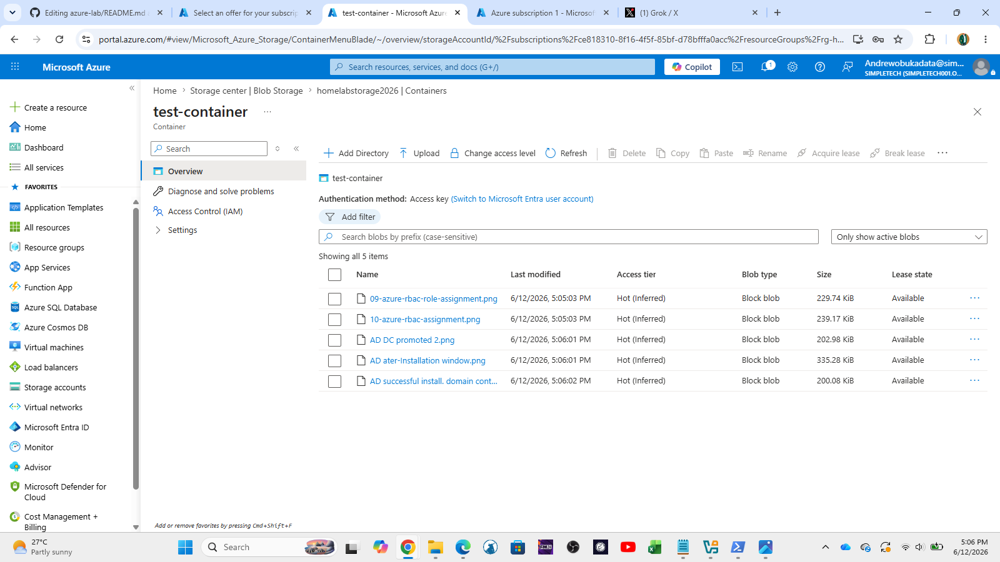
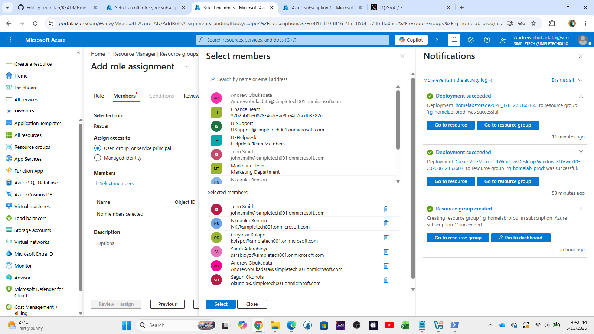
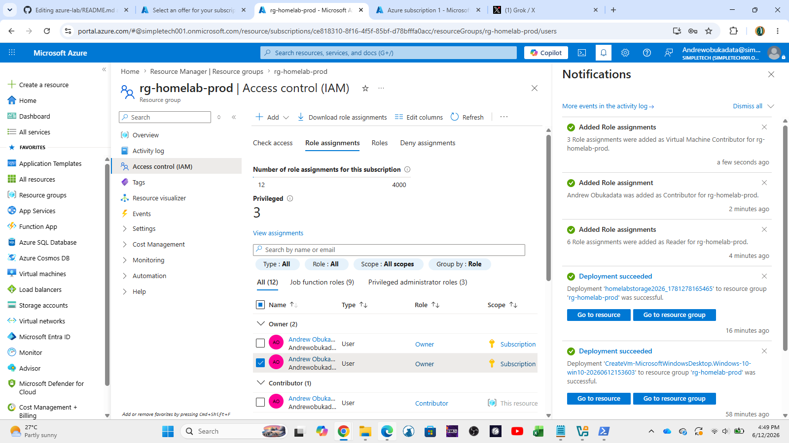

# Azure Lab

Hands-on Azure Free Tier lab focused on practical skills for **IT Support, Helpdesk, and Junior Cloud Administrator** roles.

### Lab Overview
- **Subscription**: Azure Free Tier
- **Resource Group**: rg-homelab-prod
- **Status**: In Progress

### Completed Tasks

**✅ Resource Groups**
- Created dedicated Resource Group for the homelab

**✅ Virtual Machines**
- Deployed Windows Virtual Machine
- Configured RDP access

**✅ Azure Networking**
- Explored Virtual Network (VNet) and Subnets
- Reviewed Network Security Group (NSG) rules

**✅ Storage Accounts**
- Created Storage Account
- Uploaded files to Blob Container

**✅ Role-Based Access Control (RBAC)**
- Assigned built-in roles (Contributor, Reader, etc.)

### Screenshots

  
  
  
  
  
  
  
  
  

### Skills Practiced
- Azure Resource Management
- Virtual Machine deployment and connectivity
- Azure Networking fundamentals (VNet, Subnet, NSG)
- Storage Account and Blob Storage management
- Role-Based Access Control (RBAC)
- Basic Azure troubleshooting

### Next Tasks To Complete
- Azure Monitor & Alerts
- Cost Management & Budgets
- Azure Backup / Snapshots
- PowerShell / Azure CLI basics

---

**Last Updated**: June 12, 2026

→ Back to [Main Homelab](../README.md)
