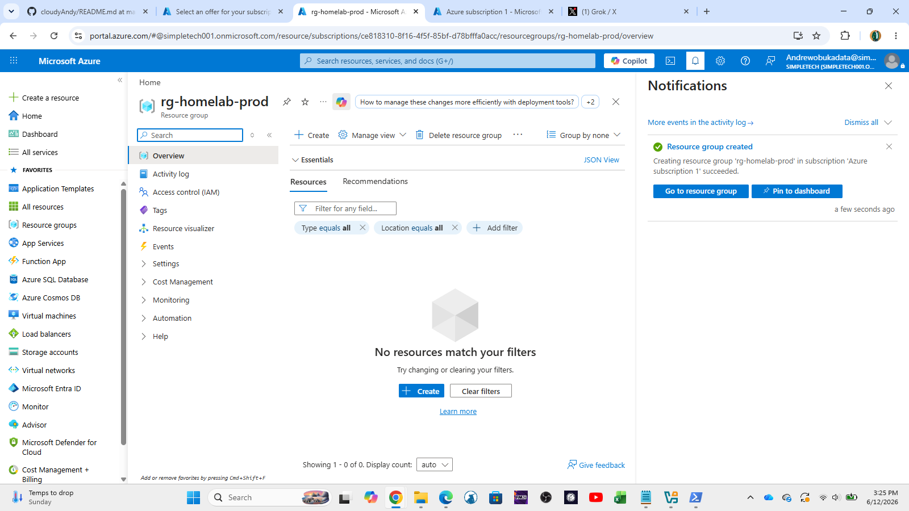

# Azure Lab

Hands-on Azure Free Tier lab focused on practical skills for **IT Support, Helpdesk, and Junior Cloud Administrator** roles.

### Lab Overview
- **Subscription**: Azure Free Tier
- **Purpose**: Learn core Azure infrastructure, networking, and management skills
- **Status**: In Progress

### Completed Tasks

**✅ Resource Groups & Organization**
- Created dedicated Resource Groups for different environments (Production, Test, Networking)

**✅ Virtual Machines**
- Created and deployed Windows Virtual Machine
- Configured RDP access
- Managed VM sizing, shutdowns, and basic monitoring

**✅ Azure Networking Basics**
- Created Virtual Network (VNet)
- Created Subnets
- Configured Network Security Groups (NSG)
- Tested connectivity to VM

**✅ Storage**
- Created Storage Account
- Uploaded files to Blob Storage
- Configured access permissions

**✅ Role-Based Access Control (RBAC)**
- Assigned roles (Owner, Contributor, Reader) to test users

### Screenshots
  
  
  
  

### Skills Practiced
- Azure Resource Management
- Virtual Machine deployment and connectivity
- Azure Networking fundamentals (VNet, Subnet, NSG)
- Storage Account management
- Role-Based Access Control (RBAC)
- Basic troubleshooting in Azure

### Next Tasks To Complete
- Azure Backup & Snapshots
- Azure Monitor & Alerts
- Application Gateway / Load Balancer basics
- Cost Management & Tagging

---

**Last Updated**: June 12, 2026

→ Back to [Main Homelab](../README.md)
